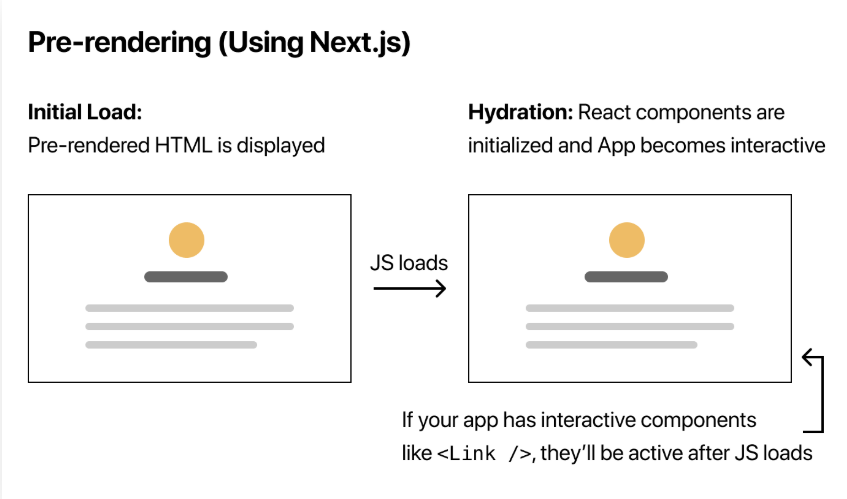
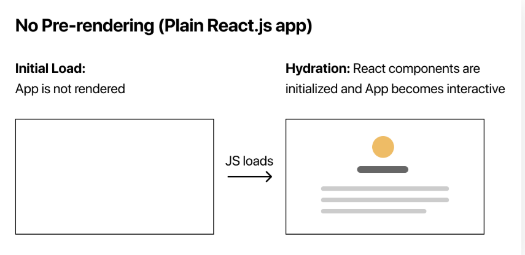
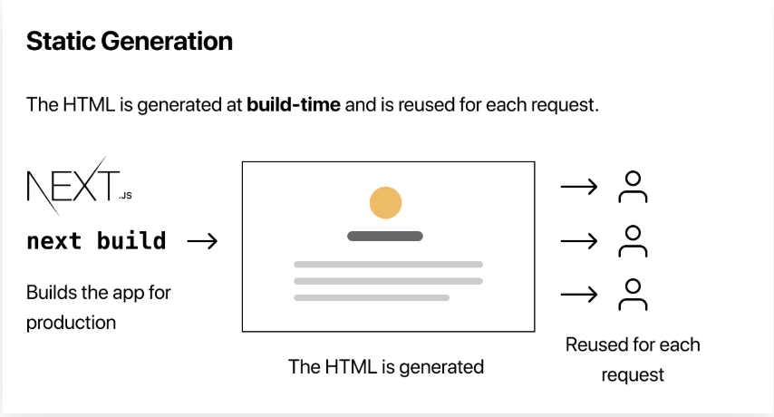
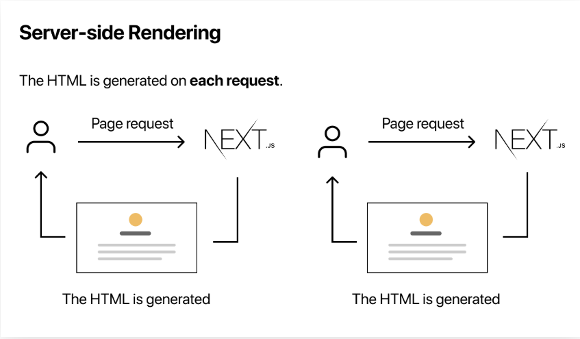
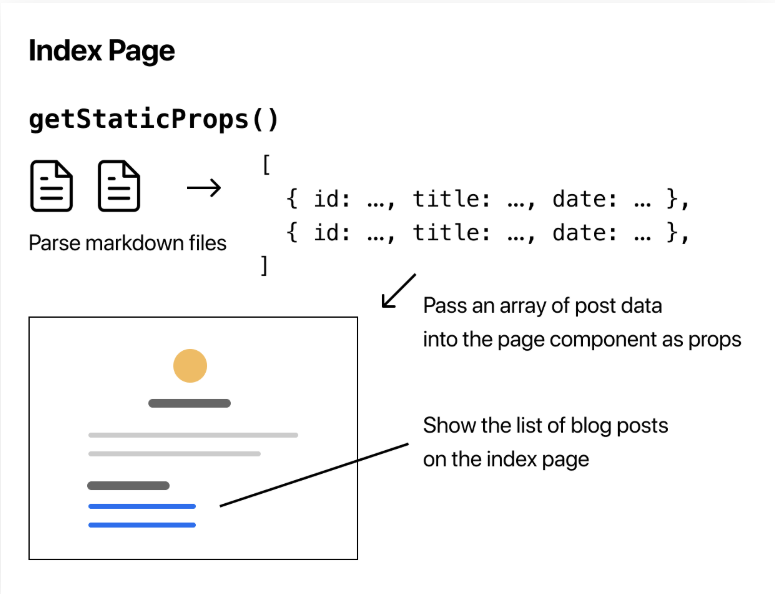
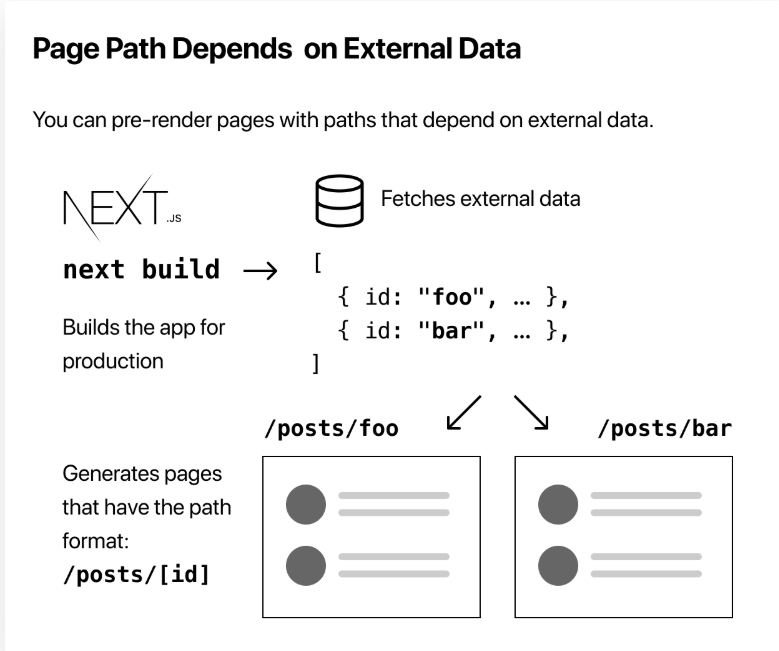

## 서버 사이드 렌더링 Next.js

### 서버 사이드 렌더링 왜 필요한가요? :question:

1. 초기 렌더링 속도가 빠르다.  

view를 서버에서 렌더링해서 가져오기 때문에 첫 로딩이 매우 빠르다. CSR같은 경우에는 브라우저에서 JS가 로딩되고 실행될 때 까지 사용자는 비어있는 페이지를 봐야한다. 여기에 API까지 호출해야 한다면 사용자이 대기시간은 더 늘어난다. 서버 사이드 렌더링을 사요하면 자스크립트 파일 다운로드가 완료되지 않아도 HTML상에서 사용자가 볼 수 있는 컨텐츠가 있기에 대시 시간이 최소화된다. 물론 사용자 경험도 향상된다. (전통적인 SSR말고 SPA SSR에서를 통해서 사용자 경험이 향상된다.)

2. SEO(Search Engine Optimization)을 향상시킬 수 있다!

일반적으로 검색 엔진 크롤러들은 데이터를 긁어올 때 Ajax와 같이 동적으로 받아온 데이터는 읽어오지 못한다. (헤드리스 브라우저과 셀레니움을 이용하여 읽어올 수 있지만, 모든 페이지에 대해서 JS를 해석해서 데이터를 읽어오지는 않음) 그래서 CSR만으로는 크롤러가 읽어올 수 있는 정보가 제한적이다. SEO가 낮은 서비스는 노출이 적어져 사용자 유입이 적어질테니, 비니지스적으로 좋지못하다. 

SSR은 서버단에서 렌더링을 해주고 클라이언트에게 전달해주기 때문에, 검색 엔진 크롤러들은 많은 정보를 수집할 수 있다. 상대적으로 SEO를 향상 시켜 사용자를 많이 유입시킬 수 있다. 

### 전통적인 SSR(Server-Side Rendering)은 별로던데요...

전통적인 SSR은 페이지가 달라질 때마다 새롭게 모든 view를 렌더링해야 하기 때문에 사용자 경험이 떨어진다. 페이지가 바뀔때마다 전체가 깜빡거리니까! 새롭게 렌더링하는데 걸리는 대기시간이 너무 별로다.

그러나 SPA에서 SSR은 CSR의 단점을 극복할 수 있다.  클라이언트 사이드 라우팅을 통해 페이지가 바뀌어도 깜빡거리 않고 일부분만 렌더링할 수 있다. 또한 필요에 따라 일부분은 CSR, SSR 따로 적용 하여 사용할 수도 있다. 

### 클라이언트 사이드 라우팅 

`클라이언트 측 경로는 경로가 페이지에 로드된 JS에 의해 내부적으로 처리될 때 발생한다.` 사용자가 링크를 클릭하면 URL은 변경되지만, 서버에 대한 요청은 방지된다. 

장점

- 처리되는 데이터가 적기 때문에 일반적으로 라우팅간 속도가 빠르다.
- 뷰간 부드러운 전환 및 에니메이션을 구현하기 쉽다.

단점

- 첫 번째 요청시 전체 웹사이트 또는 웹 응용 프로그램을 로드해야 한다. 초기 로드가 좀 걸린다. 
- 더 많은 설정 작업이나 라이브러리가 필요하여 진입장벽이 있다.

### Next.js 소개

Nest.js에서 설명하는 말을 다음과 같다 .

- 기본적으로 서버 렌더링
- 보다 빠른 페이지 로드를 위한 자동 코드 스플리팅
- 간단한 클라이언트 사이드 라우팅(page 기반)
- [Hot Module Replacement](https://webpack.js.org/concepts/hot-module-replacement/)(HMR)을 지원하는 웹팩 기반 개발 환경
- 익스프레스 혹은 어떤 Node.js HTTP server로 구현이 가능
- 바벨과 웹펙 설정으로 사용자 정의 가능

장점

- 코드 스플리팅, 데이터 로딩, 서버 사이드 렌더링을 아주 쉽게 적용 할 수 있다.
- 서버 사이드 렌더링을 통해서 초기 렌더링 속도를 높힐 수 있다!

단점 

- 리액트 라우터와 호완되지 않음. 라우터 점유율이 가장 높은데 호환되지 않아 꽤 치명적!
- 이미 리액트 라우터를 사용했다면 적용하는 것이 매우 까다로움.

#### 사전 렌더링(Pre-rendering)

Next.js에서 사전 렌더링은 크게 두가지로 나뉜다. 

- 스태틱 생성(Static Generatoin): 미리 작성된 HTML을 생성하는 사전 렌더링 방법
- 서버 사이드 렌더링: 각 요청에 따라 HTML 생성하여 렌더링한다.

Next.js는 사전 렌더링 양식을 선택할 수 있다. 대부분의 페이지에 정적 생성을 사용하고 다른 페이지에 서버 측 렌더링을 사용하여 하이브리드 Next.js앱을 만들 수 있다. 

그렇다면 어느 방식의 사전 렌더링을 사용하는 것이 좋을까?

#### Static Generation v.s. Server-side Rendering

사용자 요청보다 먼저 페이지를 미리 렌더링할 수 있다면 정적 생성을.. 그게 아니라면 서버 사이드 렌더링을 사용해야 한다. 정적 생성이 좀 더 빠르다. 다음과 같은 페이지에서는 정적 생성을 사용하면 유리할 것이다. (Next.js에서는 정적 생성을 좀 더 선호 함)

- 마케팅 페이지
- 블로그 게시물(인증없이 볼수 있는 게시물)
- 전자 상거래 제품 목록
- 도움말 및 설명서

정적 생성은 한 번 페이지를 렌더링해서 브라우저에 보내주면 다시 서버에게 요청하지 않기 때문에 아님최신 데이터를 보여줄 수 없다. 매번 최신의 데이터를 보여줘야 하는 것들은 서버사이드 렌더링이 더 좋을 것이다! 그게 아니라면 CSR로 빼놔도 된다.

정적 생성에서도 외부 데이터를 받아서 HTML 생성이 가능하다.  getStaticProps를 이용한다면..!

#### Next.js로 동적 라우팅도 가능하다! 

getStaticPaths를 이용한다면 동적 라우트로 할 수 있다.

### 의문점

1. Next.js는 서버 사이드 렌더링이면서 동시에 클라이언트 사이드 라우팅을 제공한다. 서버 사이드 렌더링은 빠르고, 클라이언트 사이드 라우팅은 느리다. 그렇다면 제로썸이 되는게 아닐까? 

2. Next.js에서 정적 생성과 서버 사이드 렌더링 구분하기. 서버에서 모든 정적 생성을 해서 주면 받아야 할 데이터가 많기 때문에 오히려 초기 렌더링이 더 느릴 것 같다. 흠...  이걸 코드 분할로 해결하는 것일까?(사실 1번이랑 같은 질문)

=> 유저가 흔히 접근하는 메인페이지나, SEO를 높혀야 할 페이제에 대해서만 SSR을 적용하고 나머지에서는 CSR을 적용하면 되는게 아닐까? 아마도 맞겠지...

### Gatsby란?

웹사이트 생성기, 웹사이트 개발 툴

기본적으로 GraphQL을 사용해서 데이터소스에서 데이터를 가져온다 플로그인을 이ㅏ용해서 REstful하게 데이터를 가져올 수 있지만, GraphQL이 가스비에 포험되어 있어 쉽게 쓸 수 있다. 

https://blog.outsider.ne.kr/1426

### 레퍼런스

- CSR vs SSR 
[https://velog.io/@rjs1197/SSR%EA%B3%BC-CSR%EC%9D%98-%EC%B0%A8%EC%9D%B4%EB%A5%BC-%EC%95%8C%EC%95%84%EB%B3%B4%EC%9E%90](https://velog.io/@rjs1197/SSR과-CSR의-차이를-알아보자)

- NEXT.js 예제

  https://nextjs.org/learn/basics/create-nextjs-app

